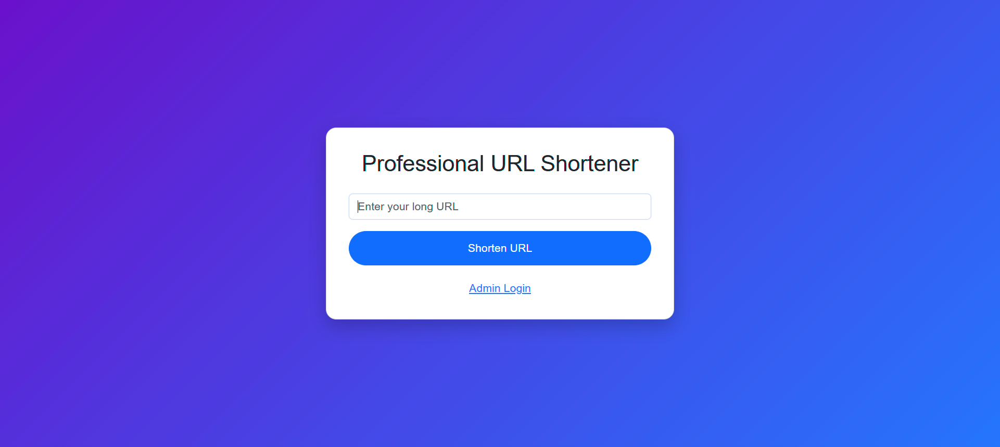

# 🚀 PHP Professional URL Shortener

[](https://github.com/DigitalEforce/php-url-shortener-pro/issues)
[](https://github.com/DigitalEforce/php-url-shortener-pro/network)
[](https://github.com/DigitalEforce/php-url-shortener-pro/stargazers)
[](LICENSE.md)

A **professional PHP URL shortener** with admin dashboard and analytics.  
Built with **Bootstrap 5** for a modern, responsive interface. Easily shorten URLs, track clicks, and manage statistics from a secure admin dashboard.

---

## 🌟 Features

- Shorten URLs with `/r/shortcode` format  
- Admin dashboard to view all shortened URLs and click statistics  
- Guest/registered user tracking  
- Click analytics with timestamp, IP, user-agent, and country  
- Secure project structure (`app/`, `api/`, `public/`)  
- Clean, responsive UI with **Bootstrap 5**  
- Optional QR code generation for shortened URLs  

---

## 🛠 Installation

1. **Clone the repository**

```bash
git clone https://github.com/DigitalEforce/php-url-shortener-pro.git


2. **Import the database** via `database/database.sql`.
3. **Configure database** in `app/config.php`:

\`php
$host = "localhost";
$dbname = "url_shortener";
$username = "root";
$password = "";
\`

4. **Set up `.htaccess`** (optional, for `/r/shortcode` URLs)

\`\`\`apache
RewriteEngine On
RewriteBase /php-url-shortener-pro/public/
RewriteRule ^r/([a-zA-Z0-9]+)$ redirect.php?c=$1 [L,QSA]
RewriteRule ^$ index.php [L]
\`\`\`

5. **Access the project**
- Public: `http://localhost/php-url-shortener-pro/public/`  
- Admin: `http://localhost/php-url-shortener-pro/public/admin/login.php`

---

## 🎯 Usage

### Public

1. Open homepage: `http://localhost/php-url-shortener-pro/public/`
2. Paste the long URL into the input field.
3. Click **Shorten URL**.
4. Copy the generated short URL, e.g., `http://localhost/php-url-shortener-pro/public/r/abc123`

### Admin

- Login URL: `http://localhost/php-url-shortener-pro/public/admin/login.php`
- **Username:** `admin`  
- **Password:** `admin123`

**Admin Dashboard Features:**

- View all shortened URLs
- Track clicks and user statistics
- Manage guest/general users
- Export analytics (optional)

---

## ⚡ Contribution

We welcome contributions!  

1. Fork the repository  
2. Clone your fork locally  
3. Create a feature branch: `git checkout -b feature-name`  
4. Make changes  
5. Commit your changes: `git commit -m "Add feature"`  
6. Push to your branch: `git push origin feature-name`  
7. Open a Pull Request  

See [`CONTRIBUTING.md`](CONTRIBUTING.md) for full guidelines.

---

## 🖼 Screenshots (Optional)

  


---

## 📌 About Me

I am [Naveed](https://github.com/DigitalEforce), a passionate PHP developer.  
I specialize in creating modern, secure, and professional web applications using PHP, MySQL, and Bootstrap.  

Check my GitHub for more projects: [https://github.com/DigitalEforce](https://github.com/DigitalEforce)

---

## 📄 License

MIT License
